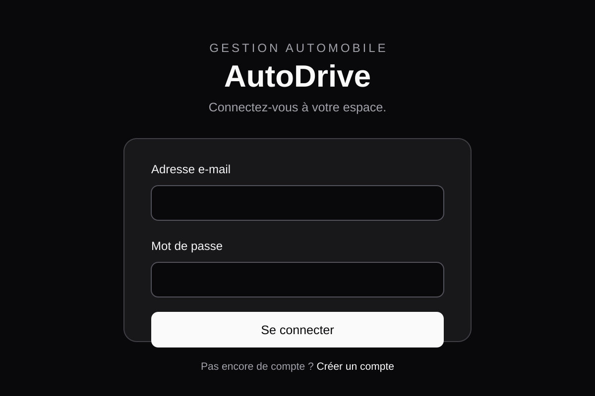
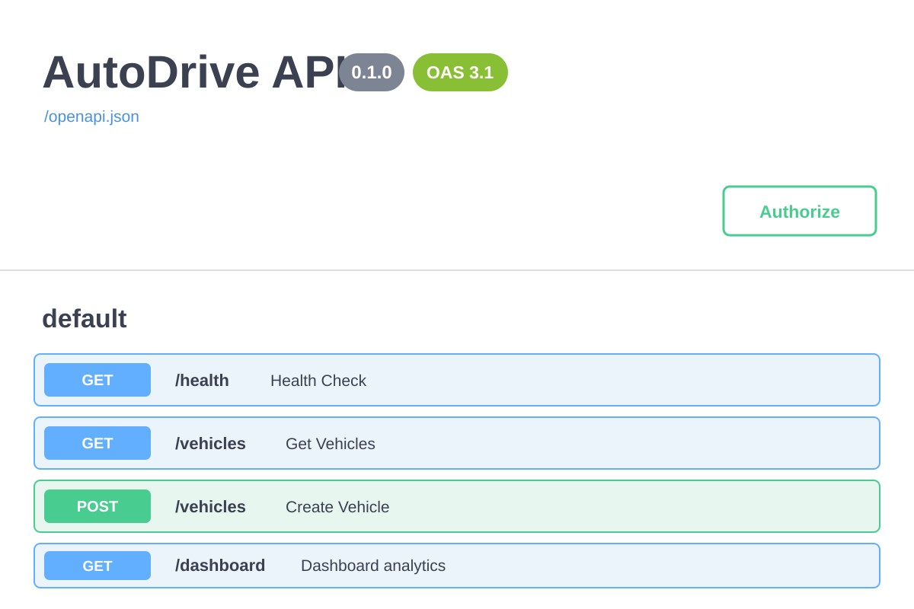
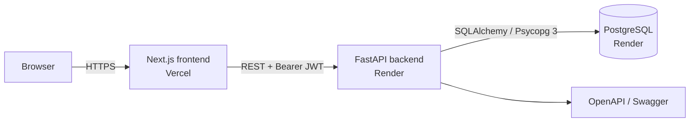
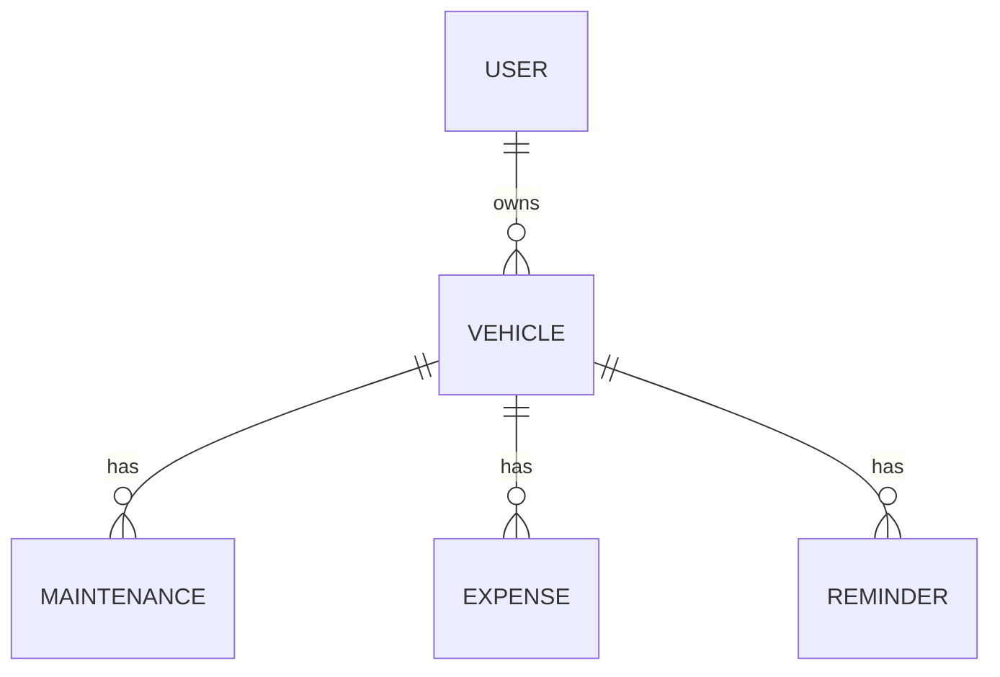

# AutoDrive 🚗

[](https://github.com/syrine291100/Autodrive/actions/workflows/ci.yml)


AutoDrive is a full-stack vehicle management application that centralizes vehicles, maintenance history, expenses, reminders and spending analytics in one authenticated workspace.

**Live application:** https://autodrive-lilac.vercel.app  
**API:** https://autodrive-api-idsz.onrender.com  
**Interactive API documentation:** https://autodrive-api-idsz.onrender.com/docs

## Preview

| Web application | FastAPI / OpenAPI |
| --- | --- |
|  |  |

## What the application does

- account registration and login with JWT authentication;
- per-user data isolation for every vehicle and related resource;
- vehicle CRUD with registration, mileage, fuel type and model information;
- maintenance history with dates, mileage, costs and notes;
- expense tracking by category;
- reminders based on date and/or mileage, with completion state;
- dashboard totals for expenses and maintenance;
- spending breakdown by category and month;
- active and overdue reminder indicators;
- PostgreSQL schema management with Alembic migrations;
- health endpoints for both the API and database connection.

## Architecture



The repository is a monorepo: the Next.js application lives in `frontend/`, the FastAPI application in `backend/`, and local PostgreSQL is provided through Docker Compose.

For the rationale behind the main technical decisions, see [docs/ARCHITECTURE.md](docs/ARCHITECTURE.md).

## Technology stack

| Area | Technology |
| --- | --- |
| Frontend | Next.js 16, React 19, TypeScript, Tailwind CSS 4 |
| Backend | FastAPI, Python 3.12.4, Pydantic |
| Authentication | JWT (HS256), OAuth2 password flow, Argon2 password hashing |
| Data | PostgreSQL 17, SQLAlchemy 2, Psycopg 3 |
| Migrations | Alembic |
| Local infrastructure | Docker Compose |
| Frontend hosting | Vercel |
| API hosting | Render |
| Database hosting | Render PostgreSQL |
| CI | GitHub Actions |

## Data model



A `Vehicle` belongs to exactly one user. Every maintenance record, expense and reminder is reached through a vehicle, so authorization can be enforced consistently from vehicle ownership.

## Authentication and data isolation

Passwords are hashed with Argon2 and never stored in plain text. Successful login returns a signed JWT used as a Bearer token for protected routes.

The backend scopes vehicle queries to the authenticated user and applies the same ownership checks to maintenance, expense, reminder and dashboard operations. Cross-user access is intentionally returned as `404` instead of exposing whether another user's resource exists.

Secrets and deployment-specific URLs are configured through environment variables and are not committed to the repository.

## Continuous integration

The GitHub Actions workflow runs on every pull request targeting `main` and on pushes to `main`.

**Backend checks**
- installs the Python dependencies;
- starts an ephemeral PostgreSQL 17 service;
- validates Python syntax;
- applies Alembic migrations from an empty database;
- runs `alembic check`;
- runs API integration tests for health checks, authentication, user isolation, vehicle CRUD and dashboard aggregation.

**Frontend checks**
- installs dependencies with `npm ci`;
- runs ESLint;
- builds the production Next.js application.

## Run locally

### Prerequisites

- Python 3.12.4;
- Node.js 20.9 or newer;
- Docker with Docker Compose;
- Git.

### 1. Start PostgreSQL

From the repository root:

```bash
docker compose up -d
```

The development database is exposed on `localhost:5433`.

### 2. Start the backend

```bash
cd backend
python -m venv .venv
```

Activate the virtual environment:

**Windows**

```cmd
.venv\Scripts\activate
```

**macOS / Linux**

```bash
source .venv/bin/activate
```

Then install dependencies and configure the environment:

```bash
pip install -r requirements.txt
```

Copy `backend/.env.example` to `backend/.env`, then replace `JWT_SECRET_KEY` with a strong local secret. A secret can be generated with:

```bash
python -c "import secrets; print(secrets.token_urlsafe(48))"
```

Apply the schema and start the API:

```bash
alembic upgrade head
uvicorn main:app --reload
```

Backend URLs:

- API: `http://127.0.0.1:8000`
- Swagger: `http://127.0.0.1:8000/docs`
- database health: `http://127.0.0.1:8000/health/database`

### 3. Start the frontend

In another terminal:

```bash
cd frontend
npm ci
```

Copy `frontend/.env.example` to `frontend/.env.local`, then run:

```bash
npm run dev
```

Open `http://localhost:3000`.

## Environment variables

### Backend

| Variable | Purpose |
| --- | --- |
| `DATABASE_URL` | PostgreSQL connection string |
| `JWT_SECRET_KEY` | Secret used to sign JWTs |
| `CORS_ORIGINS` | Comma-separated allowed frontend origins |

The database layer accepts both `postgresql+psycopg://...` and hosted `postgresql://...` URLs and normalizes hosted URLs to the Psycopg 3 SQLAlchemy dialect.

### Frontend

| Variable | Purpose |
| --- | --- |
| `NEXT_PUBLIC_API_URL` | Public base URL of the FastAPI backend |

## Tests

Development-only dependencies are defined in `backend/requirements-dev.txt`.

For local backend integration tests, use a disposable PostgreSQL database, apply migrations, then run:

```bash
cd backend
pip install -r requirements-dev.txt
alembic upgrade head
pytest -q
```

The CI workflow already provides a clean PostgreSQL database automatically.

## Deployment

### Backend — Render

- root directory: `backend`;
- Python: `3.12.4`;
- build command: `pip install -r requirements.txt`;
- start command: `alembic upgrade head && uvicorn main:app --host 0.0.0.0 --port $PORT`;
- environment: `DATABASE_URL`, `JWT_SECRET_KEY`, `CORS_ORIGINS`, `PYTHON_VERSION`.

### Frontend — Vercel

- framework: Next.js;
- root directory: `frontend`;
- environment: `NEXT_PUBLIC_API_URL=https://autodrive-api-idsz.onrender.com`.

The production CORS origin is set to `https://autodrive-lilac.vercel.app`.

## Repository structure

```text
Autodrive/
├── .github/
│   └── workflows/
│       └── ci.yml
├── backend/
│   ├── migrations/
│   ├── tests/
│   ├── auth.py
│   ├── database.py
│   ├── main.py
│   ├── models.py
│   ├── schemas.py
│   ├── requirements.txt
│   └── requirements-dev.txt
├── docs/
│   ├── screenshots/
│   ├── ARCHITECTURE.md
│   └── PORTFOLIO.md
├── frontend/
│   ├── app/
│   ├── public/
│   └── package.json
├── docker-compose.yml
└── README.md
```

## Further improvements

The current version is fully functional and deployed. Possible next iterations include:

- replacing local-storage JWT persistence with secure HttpOnly cookie sessions;
- pagination, filtering and search for larger datasets;
- broader automated test coverage and end-to-end browser tests;
- structured logging, error monitoring and application metrics;
- richer dashboard visualizations;
- optional export/import of vehicle history.

## Portfolio notes

Ready-to-use CV bullets, a LinkedIn project description and interview pitches are available in [docs/PORTFOLIO.md](docs/PORTFOLIO.md).

## Status

✅ Full-stack application deployed and smoke-tested end to end: account creation, authentication, vehicle management, maintenance, expenses, reminders, dashboard and data persistence.
