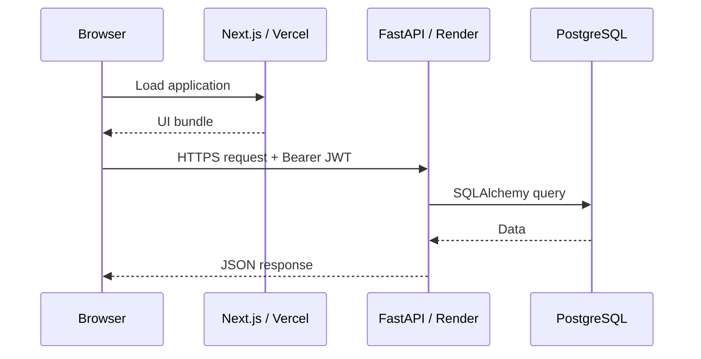

# AutoDrive architecture and technical decisions

This document explains the architecture of AutoDrive and the trade-offs behind the current implementation.

## 1. Monorepo

AutoDrive keeps the frontend and backend in a single Git repository:

```text
frontend/  -> Next.js application
backend/   -> FastAPI application and Alembic migrations
```

### Why

- one pull request can describe an end-to-end feature;
- frontend and backend versions evolve together;
- local development and CI stay easy to reproduce;
- Vercel and Render can independently deploy a subdirectory from the same repository.

## 2. Frontend / API separation

The browser runs a Next.js application and communicates with FastAPI over JSON REST endpoints.



### Why

This keeps the API reusable independently of the web interface and makes authorization rules explicit at the backend boundary.

## 3. Authentication

Registration stores an Argon2 hash rather than the original password. Login follows FastAPI's OAuth2 password-form pattern and returns an HS256 JWT.

Protected endpoints resolve the current user from the Bearer token before querying user-owned data.

### Current trade-off

The frontend persists the token in browser local storage. This is straightforward for a portfolio SPA but is more exposed to successful XSS than an HttpOnly cookie. A hardened production iteration would move session persistence to secure, `HttpOnly`, `SameSite` cookies and add CSRF considerations where appropriate.

## 4. Authorization and data isolation

The key authorization boundary is vehicle ownership:

```text
User 1 ---- * Vehicle 1 ---- * Maintenance
                     |
                     +------ * Expense
                     |
                     +------ * Reminder
```

Vehicle reads and mutations always include the authenticated user's ID. Nested resources are joined back to `Vehicle` before update/delete operations. Dashboard aggregation is filtered through the same ownership relationship.

Cross-user resource access returns `404`, which both denies access and avoids confirming whether another user's object exists.

## 5. PostgreSQL and SQLAlchemy

PostgreSQL is used in development, CI and production to avoid environment-specific database behavior.

SQLAlchemy 2 provides the ORM/data-access layer, while Psycopg 3 is the PostgreSQL driver.

Hosted Render URLs use the standard `postgresql://` scheme. `backend/database.py` normalizes that scheme to `postgresql+psycopg://` so SQLAlchemy explicitly uses Psycopg 3. `pool_pre_ping=True` checks pooled connections before reuse.

## 6. Alembic migrations

Database schema changes are versioned with Alembic.

The current baseline migration can build the complete schema from an empty PostgreSQL database. Application startup does not call `Base.metadata.create_all()`, keeping schema evolution under migration control.

This is also validated in CI:

```text
empty PostgreSQL -> alembic upgrade head -> alembic check
```

## 7. Configuration

Runtime-specific values live in environment variables:

```text
Backend:
DATABASE_URL
JWT_SECRET_KEY
CORS_ORIGINS

Frontend:
NEXT_PUBLIC_API_URL
```

`.env.example` files document the expected keys while real `.env` files remain ignored by Git.

## 8. CORS

FastAPI reads a comma-separated list from `CORS_ORIGINS`. Local development allows `http://localhost:3000`; production allows the Vercel origin.

Keeping this outside the source code avoids hard-coding one deployment domain.

## 9. Deployment

### Vercel

Vercel deploys the `frontend` root directory as a Next.js project.

### Render

Render deploys the `backend` root directory as a Python web service and hosts PostgreSQL in the same platform environment.

The backend start sequence runs migrations before Uvicorn:

```text
alembic upgrade head
uvicorn main:app --host 0.0.0.0 --port $PORT
```

For this single-instance portfolio deployment, the sequence keeps setup simple. A larger production system would normally move migrations into a dedicated release/pre-deploy step to avoid concurrent migration attempts.

## 10. Continuous integration

GitHub Actions has two independent jobs.

### Backend

- PostgreSQL 17 service container;
- Python 3.12.4;
- dependency installation;
- Python syntax validation;
- Alembic migration application and metadata check;
- integration tests through FastAPI `TestClient`.

### Frontend

- Node.js 24;
- deterministic `npm ci`;
- ESLint;
- production Next.js build.

This catches both schema/API regressions and frontend build regressions before changes reach `main`.

## 11. API design

The API exposes:

```text
/auth/register
/auth/login
/auth/me

/vehicles
/vehicles/{vehicle_id}

/vehicles/{vehicle_id}/maintenances
/maintenances/{maintenance_id}

/vehicles/{vehicle_id}/expenses
/expenses/{expense_id}

/vehicles/{vehicle_id}/reminders
/reminders/{reminder_id}

/dashboard

/health
/health/database
```

OpenAPI documentation is generated automatically by FastAPI and is available from `/docs`.

## 12. Future hardening

The next technical improvements would be:

1. HttpOnly cookie-based authentication;
2. rate limiting around authentication endpoints;
3. pagination and query filtering;
4. browser-level end-to-end tests;
5. structured logging and centralized error monitoring;
6. metrics and uptime monitoring;
7. database backups/retention appropriate to a long-running production service;
8. a dedicated migration release step for multi-instance deployment.
